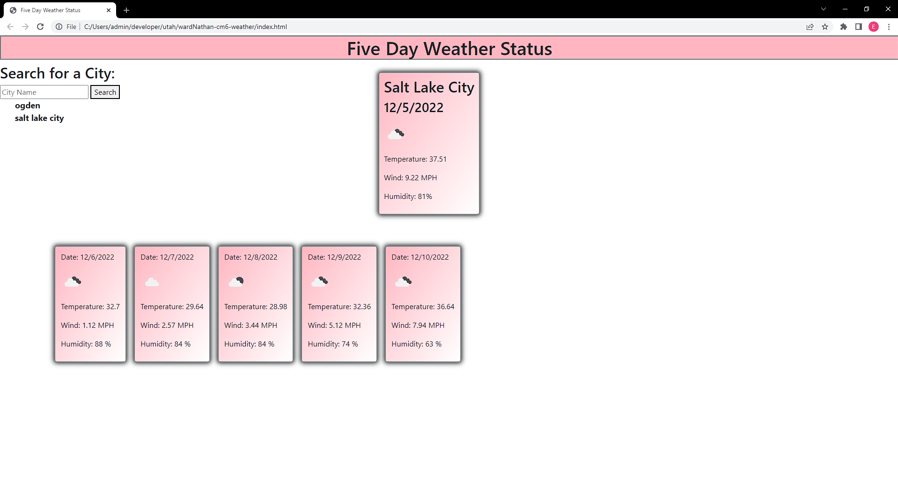

# wardNathan-cm6-weather

## Description

This project will give you the weather status of any city you look up using the search bar. It also provide a report of the next five days to better inform the user of what the weather will be looking like. A history of the user's searches will appear below the search bar so they can remember which cities they've been looking at. This project was made so I could familiarize myself with using API's.

## Installation

N/A

## Usage

A user can enter in their city of choice in the search bar to view the weather information.

## Credits

github user kfarshchian assisted with the five day layout.

## License

MIT License

## Link and Screenshot

https://wardnathan.github.io/wardNathan-cm6-weather/
